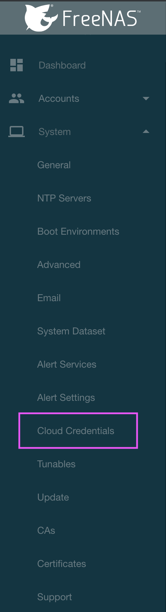
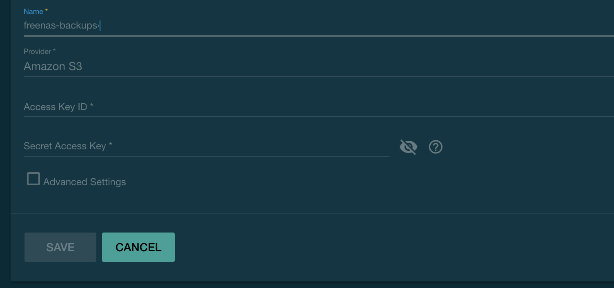

# terraform-freenas-backup

## Purpose

Easily create the components needed in AWS to allow you to backup files on FreeNAS. This is meant purely as a backup strategy and not as a means of hosting.

## Disclaimer

PLEASE NOTE: This terraform template will create an S3 bucket in your account and expenses may accrue. I am not responsibile for any expense you may accrue resulting from this terraform template.

Your IAM user credentials for the FreeNAS Cloud Sync task will be present in the terraform.tfstate file after running `terraform apply`. You will need to either delete the state file or remove the credentials by hand.

## Prerequisities

* An AWS account
* IAM credentials with full admin access
* Terraform installed
* FreeNAS version that supports cloud sync tasks

## Design

To reduce costs as much as possible FreeNAS files will live in an S3 bucket with a lifecycle policy of 30 days. After the 30 days the objects will be sent to Standard IA storage for long-term storage.

The bucket will also support versioning on your backed up files. Non-current versions will be kept for 90 days and then sent to the Glacier storage class.

You can change the default lifecycle days in the `vars.tf` file or pass a parameter at the command line.

## Usage
`vars.tf` - Take a look at this file, you may want to change the AWS region to be something closer to you for better file transfer speeds.

1) `terrform plan` - You will need to input your access/secret keys and a unique suffix, like your name or handle

2) After running `terrform plan` you should see the list of resources that will be created for you.

3) Run `terraform apply` to actually create the AWS resources in your account.

4) You will see the AWS secret and access keys output in your terminal. Save these in a password manager. You will also see your S3 bucket's name.

5) `rm terraform.tfstate` - This will remove the tfstate file that has the access/secret key in it.

6) Go to your FreeNAS UI in your web browser.

7) Add your cloud credentials.

8) Setup the Cloud Sync task to your new bucket.

9) (Optional) Run the sync task now.

